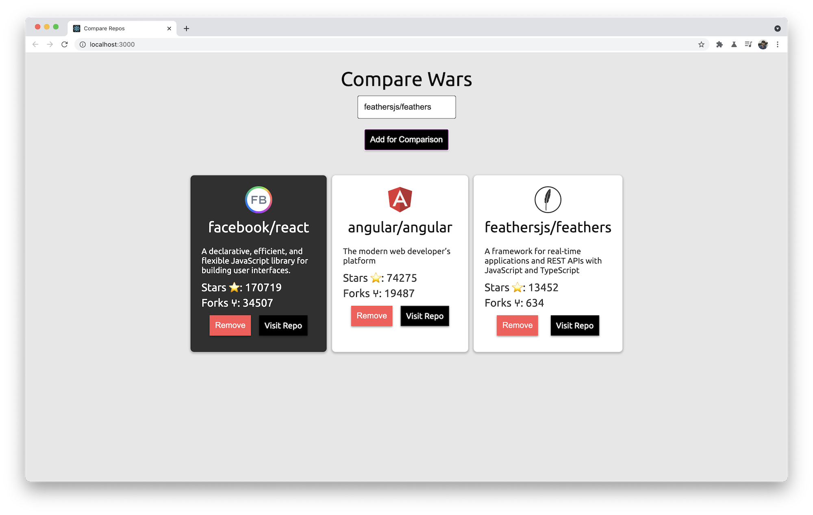

# Github repo comparing utility

We should be able to fetch repo information from Github by entering `facebook/react` (`owner/repo`) in an input field.

Here is the link for [Github Repo API](https://docs.github.com/en/rest/reference/repos)

After adding few repos to compare we also want to change the color of the repo card which has highest stars, as shown in the screenshot above.

